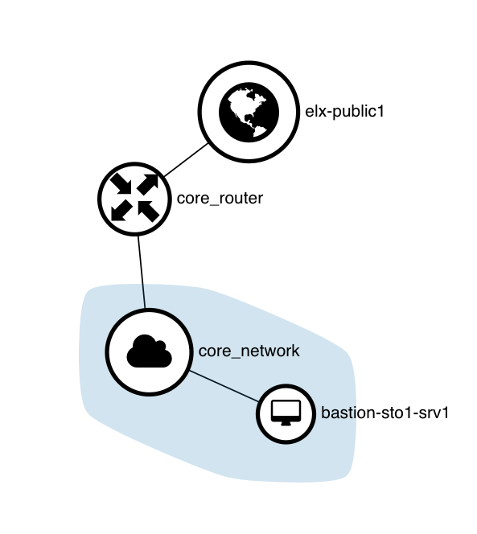

# Router, networking and bastion hosts

In this example we create a router, a network with a subnet and a bastion host. It also setups a security group which allows SSH from specified outside addresses. Members of the security group can also reach each other through SSH.

The bastion host will use *ephemeral storage* – meaning that the root volume has a direct relation to the instance. When the instance is terminated the disk will be terminated too. However, this kind of storage is the fastest in our platform as it is on the same physical hardware the instance resides on.

> What is a bastion host? [https://en.wikipedia.org/wiki/Bastion_host](https://en.wikipedia.org/wiki/Bastion_host)



> In ELASTX OpenStack, only one router per tenant/project may be used.

## Relevant files

```less
├── example.auto.tfvars
├── main.tf
├── output.tf
└── variables.tf
```

## How to run

```shell
$ terraform init

Initializing the backend...

Initializing provider plugins...

Terraform has been successfully initialized!
[...]
```

```shell
$ terraform apply

An execution plan has been generated and is shown below.
Resource actions are indicated with the following symbols:
  + create

Terraform will perform the following actions:  

[...]

Plan: 12 to add, 0 to change, 0 to destroy.

Do you want to perform these actions?
  Terraform will perform the actions described above.
  Only 'yes' will be accepted to approve.

  Enter a value: yes

[...]

Apply complete! Resources: 12 added, 0 changed, 0 destroyed.
Releasing state lock. This may take a few moments...

Outputs:

bastion_secgroup_id = 178c7749-d4d9-47d5-8127-ab306d513e92
bastion_secgroup_name = bastion
bastion_servers_ansible = [bastion_servers]
bastion-sto1-srv1 ansible_ssh_host=X.X.X.X
bastion_servers_map = {
  "bastion-sto1-srv1" = "X.X.X.X"
}
network_id = 95efc080-749b-4ea7-a12b-fb7131f75768
network_name = core_network
subnet_id = 9eaf5e72-e33f-4e06-b892-f76842b586a0
subnet_name = core_subnet
```

```shell
$ terraform state list
null_resource.waiter["bastion-sto1-srv1"]
openstack_compute_floatingip_associate_v2.bastion_fip["bastion-sto1-srv1"]
openstack_compute_instance_v2.bastion["bastion-sto1-srv1"]
openstack_compute_keypair_v2.keypair["gs-elastx"]
openstack_networking_floatingip_v2.bastion["bastion-sto1-srv1"]
openstack_networking_network_v2.network
openstack_networking_router_interface_v2.router_interface
openstack_networking_router_v2.router
openstack_networking_secgroup_rule_v2.bastions_trust
openstack_networking_secgroup_rule_v2.trusted_endpoints["world"]
openstack_networking_secgroup_v2.bastion
openstack_networking_subnet_v2.subnet
```

```shell
$ openstack server list
+--------------------------------------+-------------------+--------+-----------------------------------------+----------------------------+---------------+
| ID                                   | Name              | Status | Networks                                | Image                      | Flavor        |
+--------------------------------------+-------------------+--------+-----------------------------------------+----------------------------+---------------+
| 4426b8c3-9669-4aed-9bdf-f69bed3c08c2 | bastion-sto1-srv1 | ACTIVE | core_network=10.0.65.19, X.X.X.X | ubuntu-20.04-server-latest | v1-standard-2 |
+--------------------------------------+-------------------+--------+-----------------------------------------+----------------------------+---------------+
```
